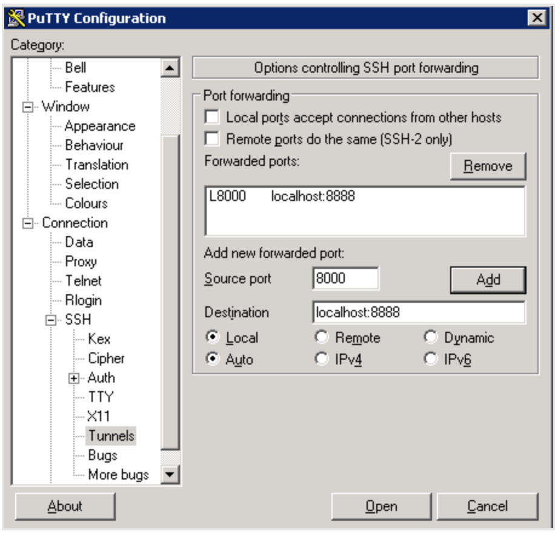
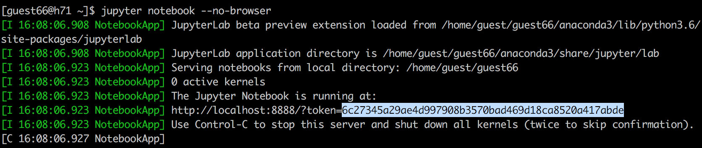
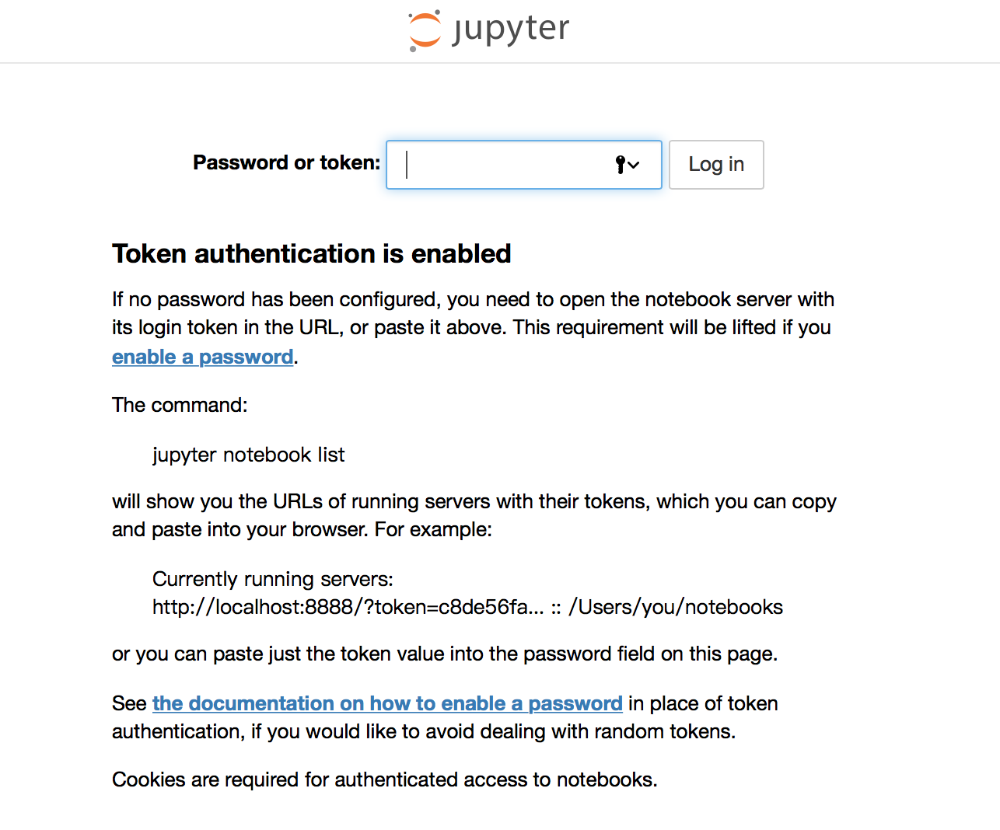

# hello-world-python

This course will mention the following stuffs:
1. How to edit and execute python files on a remote server.
2. How to use an editor for python programming on a remote server.
3. How to use functions.
4. How to import modules.  

## Before we begin
To save the time for Anaconda installation, I've done it already.  
It simply run the script by: 
`bash Anaconda3-5.2.0-Linux-x86_64.sh`

## Test a simple "Hello World" in Python
Please login and go to your own folder.  
Create a file `test.py` and write something with `print` command.  
We execute the file by `python test.py`.  
You should see the line you expect to print.  

## Try it for Jupyter Notebook  
* For mac:  
`ssh -L 8000:localhost:8888 guest66@140.112.2.71`  
* For windows:  
In addition to ip and port setting in your Putty, find SSH tunnels setting such as:  
  
  
As usual, enter your password to login. Go to your own folder and type:  
`juptyer notebook --no-browser`  
You'll see the response:  
 
Then go to your local machine browser and type:  
`http://localhost:8000`  

Paste the highlight tag then we can see what's inside!

## 
