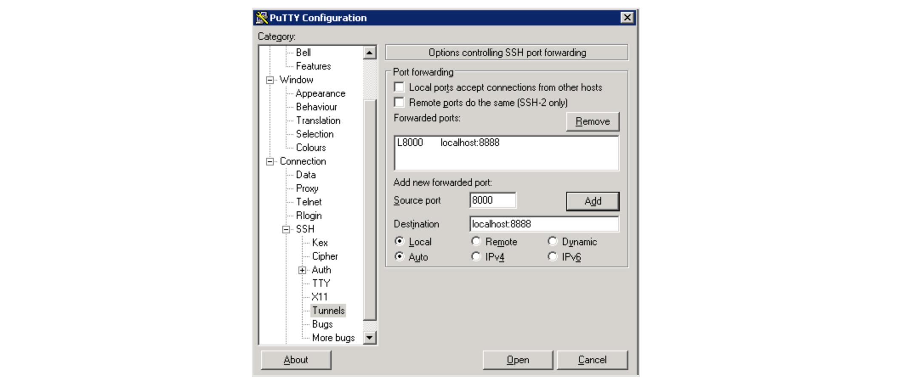

# hello-world-python

This course will mention the following stuffs:
1. How to edit and execute python files on a remote server.
2. How to use an editor for python programming on a remote server.
3. How to use functions.
4. How to import modules.  

## Before we begin
To save the time for Anaconda installation, I've done it already.  
It simply needs to run the script by: `bash Anaconda3-5.2.0-Linux-x86_64.sh`  
During the installation, the path has been exported as the process we did for blast last time.  
So now we can to test some basic commands to check if conda has been properly installed.  
Try `conda info` and `conda list`.  

## Test a simple "Hello World" in Python
Please login and go to your own folder.  
Create a file `test.py` and write something with `print` command.  
We execute the file by `python test.py`.  
You should see the line you expect to print.  

## Try it for Jupyter Notebook  
Because there's no GUI support in the shell interface, if we call an editor remotely, it's unable to show. We need another way to open the editor in our own local machine.  
* For mac:  
`ssh -L 8000:localhost:8888 guest66@140.112.2.71`  
* For windows:  
In addition to ip and port setting in your Putty, find SSH tunnels setting such as:  
  
  
As usual, enter your password to login.    
`juptyer notebook --no-browser`  
You'll see the response:  
 
Then go to your local machine browser and type:  
`http://localhost:8000`  

Copy the highlighted token and paste to the required field then we can see what's inside!

## Let's start today's lesson!
Go to `python_workshop/day_2` and click `function_demo.ipynb`.
